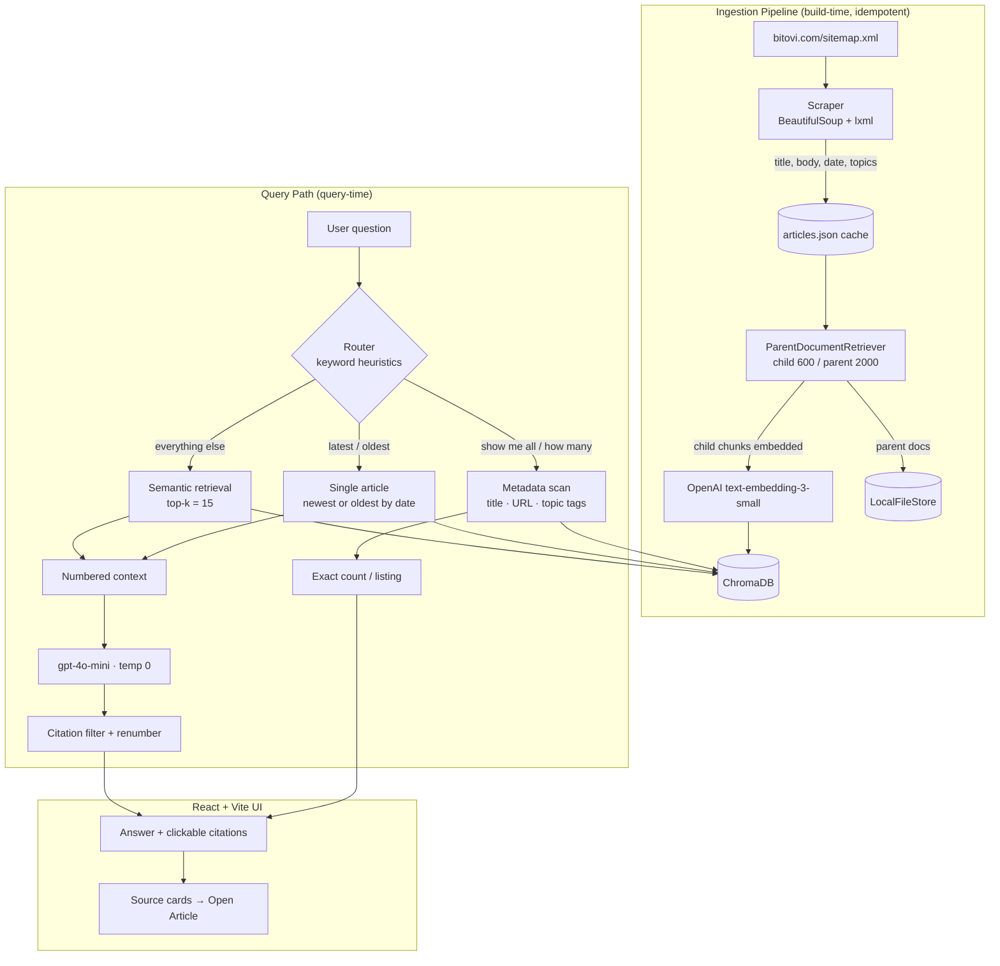

# Bitovi Blog AI Agent

A Retrieval-Augmented Generation (RAG) app that answers natural-language questions about Bitovi's blog. It scrapes all ~460 articles into a persistent vector store and serves grounded, citation-backed answers via a FastAPI backend and React UI.

Its defining decision: **knowledge** questions ("what does Bitovi recommend for E2E testing?") use semantic retrieval + an LLM, while **discovery** questions ("how many AI articles are there?") use deterministic metadata filtering over Bitovi's topic tags — each routed to the strategy that produces a correct, verifiable answer.

## Live Demo

- **Frontend:** https://bitovi.artfricastudio.com/
- **Backend API (interactive docs):** https://api-bitovi.artfricastudio.com/docs
- **Demo video:** _TODO_

---

## Features

- **Automated ingestion** — One `POST /ingest` discovers every article from `sitemap.xml` (filtering tag/author/index pages) and scrapes it in a background thread with live progress. Idempotent: skips re-ingest if the index is already populated.
- **Content extraction** — Title (`og:title`), body (`<article>` only, to drop nav/footer noise), published date (`<time>`), and **topic tags** (`/blog/topic/...` links). Empty pages are skipped.
- **Parent/child chunking** — 600-char child chunks embedded for precise search; 2000-char parents returned to the LLM for context.
- **Citations** — The LLM must cite every claim as `[N]`; the backend drops uncited sources, renumbers the rest, and the UI renders each `[N]` as a link to the source article.
- **Discovery & date paths** — Listing/count questions bypass the LLM for exact answers; "latest"/"oldest" questions select a single article by date, then summarize it.
- **UI** — Split-pane chat + ingestion panel with source cards and an observability strip (indexed count, last-indexed time, models in use).

---

## Architecture Overview

Three stages: a **build-time ingestion pipeline** that constructs the index (triggerable at runtime via `POST /ingest`), a **query-time path** that routes each question to one of four strategies, and a **React UI** driving both.



---

## Design Decisions

**Why RAG.** The corpus changes regularly and answers must cite their source. RAG keeps knowledge external and swappable on re-ingest, and grounds every answer in a specific article — which fine-tuning and long-context prompting don't give cleanly.

**Dual-path routing — the core decision.** A blog Q&A system serves two question shapes that need different machinery:

- *Knowledge queries* ("what testing tools does Bitovi recommend?") need **semantic retrieval** — the answer rarely shares vocabulary with the question, so embedding similarity wins. Full retrieve → ground → generate pipeline.
- *Discovery queries* ("how many DevOps articles?") need **exact metadata filtering**. Vector search returns the top-`k` *similar* chunks — it has no notion of "all" or "how many," so counting with it is a category error. Instead a deterministic scan runs over every article's title, URL, and Bitovi `/blog/topic/` tags, which also catches articles *tagged* DevOps without the word in the title. No LLM, exact results.

Two **date-based paths** (recency / oldest) select a single article by `published_date`, then summarize it through the knowledge pipeline — the right signal for "newest/oldest," which similarity isn't.

*Tradeoff:* routing is keyword-heuristic, not an LLM classifier — fast and deterministic, but brittle on phrasings without a trigger word.
**Parent/child chunking.** `ParentDocumentRetriever` searches over 600-char children for sharp similarity but returns their 2000-char parents for generation — precise retrieval, rich context. Titles are prepended before chunking to keep proper-name queries retrievable.

**Source attribution.** Context is numbered `[Source N]` blocks; the prompt requires a citation per claim. After generation, uncited sources are dropped and the rest renumbered, so inline markers and the displayed source cards always match.

**Hallucination mitigation.** Defense in depth: temperature 0; a "cite it or don't say it" prompt; dropping uncited sources so shown evidence is always the evidence used; and computing discovery counts in code so the model can't fabricate a number.

**Retrieval confidence (known limitation).** Retrieval is a fixed top-`k` of 15 with no similarity threshold or reranker — confidence today is behavioral (answer only from context, flag gaps, treat empty citations as "no answer"). A score-based gate is the planned next step.

---

## Technology Stack

| Technology | Why |
|---|---|
| **FastAPI + Uvicorn** | Async, Pydantic-validated, auto OpenAPI docs; background tasks drive long-running ingestion. |
| **LangChain** (`langchain-classic`) | Provides `ParentDocumentRetriever` and LCEL for composing the retrieve→generate chain. |
| **ChromaDB** | Persistent, embedded, local-first — no separate server; swappable for a hosted store without touching chain logic. |
| **OpenAI `text-embedding-3-small`** | Strong retrieval at low cost; the small tier is ample for ~460 articles. |
| **OpenAI `gpt-4o-mini` (temp 0)** | Cheap and strong enough for grounded summarization. RAG makes model *quality*, not size, the lever. |
| **BeautifulSoup + lxml** | Forgiving HTML/XML parsing for the sitemap and article pages. |
| **React 19 + Vite + TypeScript** | Fast builds; type-safe API contracts shared with backend response shapes. |
| **Tailwind CSS** | Inline, reviewable styling. |

---

## Installation

**Prerequisites:** Python 3.11+, Node.js 18+, an OpenAI API key.

```bash
# Clone
git clone <repository-url>
cd "Bitovi Blog AI Agent"

# Backend
python3 -m venv .venv
source .venv/bin/activate            # Windows: .venv\Scripts\activate
pip install -r backend/requirements.txt
cp backend/.env.example backend/.env  # set OPENAI_API_KEY=sk-...

# Frontend
cd frontend
npm install
cp .env.example .env                  # optional — frontend falls back to http://localhost:8000 without it
cd ..
```

**Configuration**

| Variable | Location | Required | Description |
|---|---|---|---|
| `OPENAI_API_KEY` | `backend/.env` | **Yes** | Used for embeddings and generation. |
| `VITE_API_URL` | `frontend/.env` | No | Backend base URL. Defaults to `http://localhost:8000` if unset. |

For production builds, `frontend/.env.production` sets `VITE_API_URL` to the deployed API; Vite loads it automatically during `npm run build` (and ignores it in `npm run dev`).

Tunables (chunk sizes, `k`, model names) are constants at the top of `backend/ingest.py` and `backend/rag_chain.py`.

---

## Running the Application

```bash
# 1. Backend  (http://localhost:8000)
source .venv/bin/activate && cd backend && python main.py

# 2. Ingest (first run only) — from the UI button, or:
curl -X POST http://localhost:8000/ingest
curl http://localhost:8000/ingest/status   # poll progress
# or standalone: python ingest.py

# 3. Frontend  (http://localhost:5173)
cd frontend && npm run dev
```

Ingestion is **idempotent** — it skips if the index is populated. Articles are cached to `backend/articles.json` so reruns don't re-hit the site. To force a rebuild, delete `backend/chroma_db/`, `backend/docstore/`, and `backend/articles.json`.

---

## Deployment

Hosted on an **Ubuntu VPS (DigitalOcean)** behind two TLS-terminated Apache2 vhosts: the frontend serves the static Vite build, and `api-bitovi.artfricastudio.com` reverse-proxies to Uvicorn on `127.0.0.1:8001` (run as a `systemd` service with auto-restart). The backend is never exposed directly.

**CI/CD:** pushes to `main` trigger a **GitHub Actions** workflow that deploys to the server over SSH.

---

## Retrieval & Citation Workflow

For a knowledge query: **route** (no listing/recency keyword → semantic) → **retrieve** top-15 child chunks, resolve each to its parent → **build** numbered `[Source N]` context (chunks from one article share a number) → **generate** with `gpt-4o-mini` under the citation contract → **filter & renumber** citations to drop unused sources → **return** `{ answer, sources, generation_time }`, which the UI renders with clickable citations and source cards.

---

## Testing

Validated manually but systematically across all four routing paths.

- **Assignment queries** verified end-to-end (latest / discovery / count / knowledge). Discovery counts cross-checked by independently scanning `articles.json` with the same matching logic.
- **Hallucination:** confirmed the model abstains when context lacks the answer, and counts are computed in code so they can't drift.
- **Edge cases fixed:** topic discovery initially matched only title/URL text, undercounting articles Bitovi *tags* under a topic (e.g. DevOps returned far fewer than the site) — fixed by scraping `/blog/topic/` tags into metadata and matching those; trailing-punctuation topics (`DevOps.` matched nothing); citation/source number mismatch (`[6][7]` vs cards `[1][2]`); word-boundary matching.

A formal automated eval harness is intentional future work.

---

## Example Queries

| Question | Path | Result |
|---|---|---|
| `What is Bitovi's latest blog post about?` | Recency | Summary of the newest article. |
| `What was Bitovi's first blog post about?` | Oldest | Summary of the earliest article. |
| `Show me all Bitovi articles about DevOps.` | Discovery | Exact, exhaustive tagged list, newest first. |
| `How many articles does Bitovi have about AI?` | Discovery | Exact count, including topic-tag-only matches. |
| `What testing tools does Bitovi recommend?` | Knowledge | Grounded, citation-backed answer. |
| `What is BitOps?` | Knowledge | Cited definition synthesized from relevant articles. |

---

## Future Improvements

- **LLM-based routing** — replace keyword heuristics so phrasing variants route correctly.
- **Reranking** — a cross-encoder over the top-`k` to improve which passages reach the LLM.
- **Hybrid search** — combining BM25 and dense embeddings would improve entity-based questions where relevant facts appear as incidental mentions within semantically unrelated content. During testing, queries such as *"Who is the CEO of Bitovi?"* exposed limitations of pure dense retrieval despite the answer existing in indexed documents.
- **Confidence thresholds** — drop low-similarity chunks and abstain when nothing clears the bar.
- **Evaluation framework** — labeled Q/A/source set with recall@k, citation accuracy, faithfulness metrics.
- **Incremental ingestion** — diff the sitemap and ingest only new/changed articles for cheap scheduled refreshes.

---

## Submission Notes

Implements the exercise end-to-end: automated sitemap ingestion (~460 articles with structured metadata), parent/child chunking into a persistent vector store, semantic RAG with fully cited answers, and **deterministic** metadata/tag filtering for discovery queries rather than approximate vector search. The central decision is the **dual-path design** — routing "answer this" and "enumerate matching articles" to the strategy correct for each — with tradeoffs (heuristic routing, no reranker, no score threshold) documented rather than hidden.
