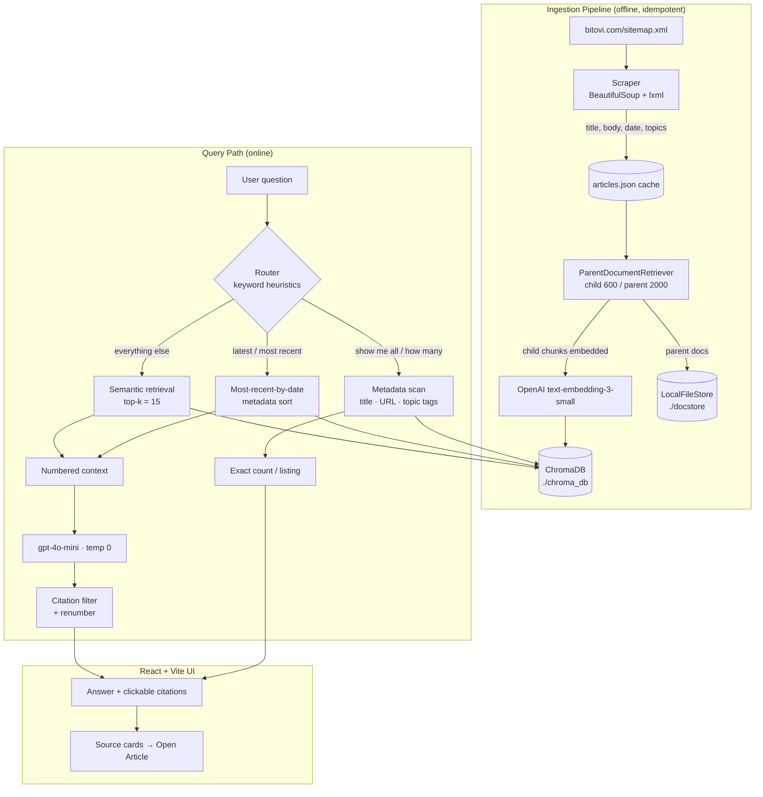

# Bitovi Blog AI Agent

A Retrieval-Augmented Generation (RAG) application that answers natural-language questions about Bitovi's engineering blog. It scrapes all ~460 published articles, embeds them into a persistent vector store, and serves grounded, citation-backed answers through a FastAPI backend and a React UI. The system distinguishes between *knowledge* questions (answered with semantic retrieval + an LLM) and *discovery* questions (answered with deterministic metadata filtering over Bitovi's own topic tags), routing each to the strategy that produces a correct, verifiable answer.

---

## Live Demo

**Frontend:** https://bitovi.artfricastudio.com/

**Backend API (interactive docs):** https://api-bitovi.artfricastudio.com/docs

## Demo Video

> _Walkthrough video: **TODO**_

---

## Features

- **Automated blog ingestion** — Discovers every blog URL from Bitovi's `sitemap.xml`, filters out tag/author/index pages, and scrapes each article. A one-shot `POST /ingest` kicks the whole pipeline off in a background thread; progress is observable in real time.
- **Content extraction** — Pulls the canonical title (`og:title`), the article body (the `<article>` element only, to avoid nav/footer noise), the published date (`<time>`), and — importantly — the article's **topic tags** (`/blog/topic/...` links). Pages with no article body are skipped rather than ingested as empty noise.
- **Chunking & embedding generation** — Uses a parent/child chunking strategy. Small child chunks (600 chars) are embedded with OpenAI `text-embedding-3-small` for precise vector matching; larger parent chunks (2000 chars) are stored separately and returned to the LLM for richer context.
- **Vector search** — ChromaDB persists embeddings to disk. Retrieval pulls the top-`k` (15) child chunks and resolves each to its parent document.
- **Retrieval-Augmented Generation** — Knowledge questions are answered by `gpt-4o-mini` (temperature 0) over a numbered, source-labeled context built from retrieved parents.
- **Source attribution & inline citations** — The model is required to cite every factual clause as `[N]`. The backend filters the answer down to *only* the sources actually cited, renumbers them so the inline markers always match the displayed cards, and the UI renders each `[N]` as a clickable link straight to the source article.
- **Discovery queries via metadata/tags** — "Show me all…" / "How many…" questions bypass the LLM entirely and run a deterministic scan over article metadata (title, URL, and Bitovi topic tags), so counts and listings are exact and complete rather than approximated by a language model.
- **Recency queries** — "Latest" / "most recent" questions are answered from the single most recently published article, selected by parsed date rather than semantic similarity.
- **Hallucination mitigation** — Temperature-0 generation, a strict "cite or don't say it" prompt contract, post-hoc citation filtering, and routing factual-listing questions away from the LLM altogether.
- **UI** — Split-pane interface: a chat panel with streamed-in log of the answer + source cards (category, date, excerpt, "Open Article" link), and an ingestion panel with a live progress log and an observability strip (indexed article count, last-indexed time, embedding/generation models).

---

## Architecture Overview

The system has three stages: an **offline ingestion pipeline** that builds the index, an **online query path** that routes each question to one of three strategies, and a **React UI** that drives both.



**Why the split.** A blog Q&A system actually serves two fundamentally different question shapes. "What does Bitovi recommend for E2E testing?" needs *semantic understanding* of unstructured prose. "How many articles are about AI?" needs an *exact, exhaustive count* — exactly the thing a top-`k` vector search is structurally incapable of guaranteeing. Forcing both through one RAG pipeline produces a system that hallucinates counts and misses articles. Splitting them lets each query type use the tool that's actually correct for it.

---

## Design Decisions

### 1. Why RAG (vs. fine-tuning or a long-context dump)

The corpus changes (Bitovi publishes regularly) and the core requirement is *verifiable, attributable* answers. Fine-tuning bakes knowledge into weights with no provenance and a stale snapshot. Dumping all ~460 articles into a long context window is cost-prohibitive per query and dilutes relevance. RAG keeps the knowledge external, swappable on re-ingest, and — critically — lets every answer point back to the exact source article. Attribution is a first-class requirement here, and RAG is the only one of the three that provides it natively.

### 2. Why metadata filtering for discovery queries

Vector search returns the `k` *most similar* chunks — it has no notion of "all" or "how many." Asking it to enumerate every DevOps article is a category error: you'd get the 15 closest chunks and a model guessing at a total. Discovery queries (`show me all`, `how many`) instead run a deterministic regex scan over **every** article's metadata, matching against title, URL slug, and Bitovi's own `/blog/topic/` tags. The result is exhaustive and exact — and because it reuses Bitovi's curated topic taxonomy, it catches articles that are *tagged* DevOps even when the word never appears in the title (e.g. an AI-agents guide that Bitovi filed under DevOps). Word-boundary matching (`\bAI\b`) prevents `AI` from matching `available` or `training`.

**Tradeoff:** routing is currently keyword-heuristic (a phrase list), not an LLM classifier. This is fast, free, and fully predictable, but it's brittle at the edges — "which posts cover DevOps?" doesn't contain a listing keyword and would fall through to semantic RAG. An LLM-based router is the obvious upgrade (see Future Improvements); the heuristic was chosen deliberately to keep the discovery path deterministic and zero-latency for the common phrasings.

### 3. Why semantic retrieval for knowledge queries

Conceptual questions ("what testing tools does Bitovi recommend?") rarely share vocabulary with the relevant passages — an article might recommend Cypress without ever using the word "recommend." Embedding-based similarity captures meaning rather than keywords, which is exactly what these questions need. Knowledge queries therefore go through the full retrieve → ground → generate pipeline.

### 4. Chunking strategy: parent/child retrieval

This is the most consequential retrieval decision. There's an inherent tension: **small chunks embed precisely but lack context; large chunks carry context but embed fuzzily.** The `ParentDocumentRetriever` resolves it by decoupling the two:

- **Child chunks (600 chars, 75 overlap)** are embedded and searched — small enough that each vector represents a focused idea, so similarity scores are sharp.
- **Parent chunks (2000 chars, 200 overlap)** are what actually get handed to the LLM — large enough to preserve the surrounding argument so the model isn't reasoning over a sentence fragment.

We search precisely and generate richly. One additional trick: the article **title is prepended to its content before chunking**, so proper-name queries ("who is the CEO?", "what is BitOps?") remain retrievable even when the body refers to the subject obliquely.

### 5. Source attribution strategy

The prompt makes citation a hard contract ("Do not write any factual claim without a citation. If you cannot cite it, do not say it."). Context is presented as numbered `[Source N]` blocks, with multiple chunks from the same article collapsed under one number. After generation, `_filter_cited_sources` parses the `[N]` markers actually present in the answer and **discards every source the model didn't use** — so the source cards reflect what genuinely informed the answer, not just what was retrieved. It then **renumbers**: if the model cited sources 6 and 7 out of 8 retrieved, those become `[1]` and `[2]` in both the text and the cards, so the inline markers and the displayed list never drift out of sync. The UI turns each marker into a direct link to the article.

### 6. Hallucination prevention

Defense in depth rather than one silver bullet:
- **Temperature 0** — deterministic, low-creativity generation.
- **Strict citation contract** — claims without grounding are prohibited by the prompt; the partial-answer clause ("share what you can find and note what's missing") discourages the model from inventing to fill gaps.
- **Citation filtering** — uncited sources are dropped, so the visible evidence is always the evidence actually used.
- **Routing factual questions out of the LLM** — counts and listings are computed in code, never generated, so the model can't hallucinate a number.

### 7. Retrieval confidence considerations

The system is honest about what it does *not* yet do: there's no similarity-score threshold or reranking step — retrieval takes a fixed top-`k` of 15. The confidence story today is behavioral, not numeric: the prompt instructs the model to answer only from context and to flag missing information, and the empty-citation case is treated as "no usable answer." A score-based confidence gate (drop low-similarity chunks, abstain when nothing clears the bar) is a deliberate next step, called out in Future Improvements rather than overclaimed here.

### 8. UI design philosophy

The interface is built around *trust and observability*. Every answer renders its sources as cards with date, excerpt, and a one-click "Open Article" link, and every inline `[N]` is a live link — so a reviewer can verify any claim in one click. The ingestion panel deliberately surfaces the normally-hidden pipeline: a live log of scraping/embedding progress and an observability strip showing indexed article count, last-indexed time, and the exact models in use. The goal is a system whose reasoning is auditable, not a black box.

---

## Query Types

The router (`query_rag`) inspects each question and dispatches it down one of three paths.

### Discovery Queries

Triggered by listing keywords (`show me all`, `list all`, `how many articles`, `every post`, …).

**Examples**
- `Show me all Bitovi articles about DevOps.`
- `How many articles does Bitovi have about AI?`

**How it works.** The topic is extracted from text following `about` / `on` / `regarding`, then `_search_articles_by_topic` scans the metadata of **every** indexed article, matching the topic (with word boundaries) against three fields:

1. the **title**,
2. the **URL slug** (hyphens normalized to spaces, so `devops` matches `devops-consulting`),
3. Bitovi's **topic tags** scraped from the article's `/blog/topic/` links.

Matches are de-duplicated by URL and sorted newest-first. The answer is a computed string (`Found N article(s) about 'X'.`) and the full matching list is returned as sources — **no LLM, no embeddings, exact results.** Using Bitovi's own tag taxonomy means the discovery path mirrors how the site itself categorizes content.

### Knowledge Queries

Anything that isn't a discovery or recency query.

**Examples**
- `What testing tools does Bitovi recommend?`
- `What is BitOps?`

**How it works.** The full RAG pipeline runs: the question embeds, ChromaDB returns the top-15 child chunks, each resolves to its parent document, the parents are assembled into a numbered context, and `gpt-4o-mini` generates a cited answer. Citation filtering and renumbering run before the response is returned.

### Recency Queries (bonus path)

Triggered by recency keywords (`latest`, `most recent`, `newest`, …) — e.g. `What is Bitovi's latest blog post about?`. These skip semantic search and select the single most recently *published* article by parsing `published_date`, then summarize it through the same generation + citation pipeline. Dates are the right signal for "latest"; similarity is not.

---

## Technology Stack

| Technology | Role | Why it was chosen |
|---|---|---|
| **Python 3** | Backend language | First-class ecosystem for LLM/RAG tooling; LangChain and the OpenAI SDK are Python-native. |
| **FastAPI + Uvicorn** | API server | Async, minimal boilerplate, automatic request/response validation via Pydantic, built-in OpenAPI docs. Background-task support drives the long-running ingestion without blocking the request. |
| **LangChain** (`langchain`, `langchain-classic`) | RAG orchestration | Provides the `ParentDocumentRetriever` (the core of the chunking strategy) and LCEL for composing the retrieve→generate chain declaratively. `langchain-classic` is used specifically for the parent-document retriever and KV docstore. |
| **ChromaDB** | Vector store | Persistent, embedded (no separate server to operate), and trivially local-first — ideal for a self-contained, reviewable project. Swappable for a hosted store later without touching the chain logic. |
| **OpenAI `text-embedding-3-small`** | Embeddings | Strong retrieval quality at low cost and 1536 dims; the "small" tier is more than sufficient for a ~460-article corpus and keeps ingestion cheap. |
| **OpenAI `gpt-4o-mini` (temp 0)** | Generation | Fast and inexpensive while strong enough for grounded summarization over provided context. Temperature 0 for determinism and reduced hallucination. The RAG architecture means model quality, not model size, is the lever — `mini` is the right cost/quality point. |
| **BeautifulSoup + lxml** | Scraping/parsing | Robust, forgiving HTML parsing; `lxml-xml` cleanly handles the sitemap and `lxml` the article pages. |
| **React 19 + Vite + TypeScript** | Frontend | Vite for instant dev startup and fast builds; TypeScript for type-safe API contracts shared with the backend's response shapes; React 19 for the component UI. |
| **Tailwind CSS** | Styling | Rapid, consistent styling without a separate stylesheet system; keeps the design system inline and reviewable. |
| **lucide-react** | Icons | Lightweight, consistent icon set. |

---

## Installation

### Prerequisites
- Python 3.11+
- Node.js 18+
- An OpenAI API key

### 1. Clone

```bash
git clone <repository-url>
cd "Bitovi Blog AI Agent"
```

### 2. Backend — virtual environment & dependencies

```bash
python3 -m venv .venv
source .venv/bin/activate        # Windows: .venv\Scripts\activate
pip install -r backend/requirements.txt
```

### 3. Backend — environment variables

```bash
cp backend/.env.example backend/.env
# edit backend/.env and set your key:
# OPENAI_API_KEY=sk-...
```

### 4. Frontend — dependencies & environment

```bash
cd frontend
npm install
cp .env.example .env             # VITE_API_URL defaults to http://localhost:8000
cd ..
```

---

## Configuration

| Variable | Location | Required | Description |
|---|---|---|---|
| `OPENAI_API_KEY` | `backend/.env` | **Yes** | OpenAI key used for both embeddings and generation. |
| `VITE_API_URL` | `frontend/.env` | No | Backend base URL. Defaults to `http://localhost:8000`. |

Index locations and tunables (chunk sizes, `k`, model names) live as constants at the top of `backend/ingest.py` and `backend/rag_chain.py`.

---

## Running the Application

### 1. Start the backend

```bash
source .venv/bin/activate
cd backend
python main.py            # serves on http://localhost:8000
```

### 2. Run ingestion (first run only)

Ingestion can be triggered from the UI ("Ingest Bitovi Blog" button) or directly:

```bash
# from the UI: click Ingest, or
curl -X POST http://localhost:8000/ingest
# then poll:
curl http://localhost:8000/ingest/status
```

Or run the pipeline standalone:

```bash
cd backend
python ingest.py
```

**Ingestion is idempotent.** If the ChromaDB collection already contains documents, the ingest step is skipped automatically — re-running is safe and cheap. Scraped articles are cached to `backend/articles.json`, so subsequent runs don't re-hit the live site. To force a full rebuild, delete `backend/chroma_db/`, `backend/docstore/`, and `backend/articles.json`.

### 3. Start the frontend

```bash
cd frontend
npm run dev               # serves on http://localhost:5173
```

Open the dev URL, confirm the backend health indicator is green, and ask a question.

---

## Deployment

The application runs on an **Ubuntu Linux droplet on DigitalOcean**, with the backend and frontend served as distinct concerns behind Apache.

**Backend (FastAPI).** Run as a long-lived **systemd** service rather than a foreground process, so it restarts on crash or reboot and logs through `journalctl`. A typical unit runs Uvicorn against the app inside the project's virtualenv:

```ini
# /etc/systemd/system/bitovi-backend.service
[Unit]
Description=Bitovi Blog AI Agent — FastAPI backend
After=network.target

[Service]
User=www-data
WorkingDirectory=/var/www/production/bitovi/backend
EnvironmentFile=/var/www/production/bitovi/backend/.env
ExecStart=/var/www/production/bitovi/.venv/bin/uvicorn main:app --host 127.0.0.1 --port 8001
Restart=always

[Install]
WantedBy=multi-user.target
```

```bash
sudo systemctl daemon-reload
sudo systemctl enable --now bitovi-backend
sudo systemctl status bitovi-backend
```

**Reverse proxy (Apache2).** The frontend and backend are served from two separate Apache vhosts, each with its own TLS certificate:

- `bitovi.artfricastudio.com` serves the frontend's static Vite build (`npm run build`).
- `api-bitovi.artfricastudio.com` reverse-proxies to the Uvicorn process bound on `127.0.0.1:8001`, so the backend is never exposed directly.

The frontend's `VITE_API_URL` points at the API subdomain. CORS on the backend already allows cross-origin requests (`allow_origins=["*"]` in `main.py`), so the split-origin setup works without extra configuration.

```apache
# api-bitovi.artfricastudio.com vhost (TLS terminated by Apache)
ProxyPreserveHost On
ProxyPass        /  http://127.0.0.1:8001/
ProxyPassReverse /  http://127.0.0.1:8001/
```

**Deploy summary:** Ubuntu (DigitalOcean) · systemd-managed Uvicorn · Apache2 reverse proxy + TLS · separate frontend / API subdomains · Vite static build for the frontend.

---

## Retrieval and Citation Workflow

End-to-end, here's exactly how a **knowledge** answer is produced:

1. **Route.** `query_rag` checks the question against listing- and recency-keyword lists. Neither matches → semantic path.
2. **Retrieve.** The question is embedded and ChromaDB returns the top-15 most similar **child** chunks. The `ParentDocumentRetriever` maps each child back to its **parent** (2000-char) document from the file docstore.
3. **Rank.** Ordering is ChromaDB's cosine-similarity ranking over child chunks; there is no secondary reranker (a deliberate, documented limitation).
4. **Construct context.** `_build_numbered_context` assembles the parents into numbered `[Source N: Title — Published: Date]` blocks. Multiple chunks from the same article collapse under a single source number, and a parallel `sources` list is built so source `N` ↔ `sources[N-1]`.
5. **Generate.** The numbered context + question fill the prompt template; `gpt-4o-mini` (temp 0) generates an answer under the strict citation contract.
6. **Filter & renumber citations.** `_filter_cited_sources` extracts the `[N]` markers the model actually wrote, drops every uncited source, and renumbers the survivors so the inline markers and the source list are contiguous and aligned.
7. **Display.** The API returns `{ answer, sources, generation_time }`. The UI renders the answer markdown, turns each `[N]` into a link to the corresponding article, and shows source cards with category, date, excerpt, and an "Open Article" button.

---

## Testing

Validation was done against the assignment's example queries plus deliberate adversarial and edge cases, exercising all three routing paths.

**Assignment example queries** — verified end-to-end:
- `What is Bitovi's latest blog post about?` → recency path selects the newest article by date.
- `Show me all Bitovi articles about DevOps.` → discovery path returns the exact tagged set (verified by independently scanning `articles.json` with the same matching logic — counts agreed).
- `How many articles does Bitovi have about AI?` → discovery path returns an exact count, including articles matched only by topic tag, not title/URL.
- `What testing tools does Bitovi recommend?` → knowledge path returns a cited, grounded answer.

**Hallucination tests:**
- Confirmed the model abstains / scopes down when context lacks the answer rather than inventing one (the empty-citation case yields no fabricated sources).
- Confirmed counts are never model-generated — discovery answers are computed in code, so they can't drift.

**Edge cases handled during development:**
- **Topic extraction punctuation** — `about DevOps.` (trailing period) previously produced the literal topic `DevOps.`, which matched nothing; fixed by terminating the regex on `.`/`!`/`?` and stripping trailing punctuation.
- **Citation/source number mismatch** — the model citing `[6][7]` out of 8 sources while the UI showed cards `[1][2]`; fixed by the filter-and-renumber step.
- **Word-boundary matching** — ensures `AI` doesn't match `available`/`training` and `DevOps` matches inside `devops-consulting` URL slugs.
- **Empty/contentless pages** — articles whose `<article>` body is empty are skipped at scrape time rather than polluting the index.

> A formal automated evaluation harness is intentionally future work (see below); current validation is manual but systematic across the routing matrix.

---

## Example Queries

| Question | Path | What you get |
|---|---|---|
| `What is Bitovi's latest blog post about?` | Recency | A summary of the single most recently published article. |
| `Show me all Bitovi articles about DevOps.` | Discovery | An exact, exhaustive list of DevOps-tagged articles, newest first. |
| `How many articles does Bitovi have about AI?` | Discovery | An exact count, including topic-tag-only matches. |
| `What testing tools does Bitovi recommend?` | Knowledge | A grounded, citation-backed answer with linked sources. |
| `What is BitOps?` | Knowledge | A definition synthesized from the relevant articles, cited. |

---

## Future Improvements

Honest, high-value next steps — not a wishlist:

- **LLM-based query routing** — Replace the keyword-heuristic router with a small classifier (or a cheap LLM call) so phrasing variants ("which posts cover X?", "do you have anything on Y?") route correctly instead of falling through to the wrong path.
- **Reranking** — Add a cross-encoder reranker over the top-`k` child chunks before context construction. Bi-encoder similarity is fast but coarse; a reranker would meaningfully improve which passages reach the LLM.
- **Hybrid search** — Combine dense (embedding) retrieval with sparse (BM25/keyword) retrieval. Pure vector search underperforms on exact terms, acronyms, and product names; hybrid would catch both semantics and literal matches.
- **Retrieval confidence thresholds** — Gate on similarity score: drop chunks below a threshold and explicitly abstain when nothing clears the bar, rather than always generating from a fixed top-15.
- **Evaluation framework** — A labeled question/answer/expected-source set with automated metrics (retrieval recall@k, citation accuracy, answer faithfulness) to catch regressions and quantify changes instead of eyeballing them.
- **Incremental ingestion** — Currently ingestion is all-or-nothing (re-ingest after wiping the index). Diff the sitemap against indexed URLs and ingest only new/changed articles, enabling cheap scheduled refreshes.
- **Conversational memory** — Multi-turn context so follow-ups ("what about its CI/CD support?") resolve against the previous question rather than being treated as standalone.

---

## Submission Notes

This project implements the technical exercise end-to-end:

- **Ingests the Bitovi blog** automatically from the sitemap (~460 articles), extracting clean content plus structured metadata (title, date, and Bitovi topic tags).
- **Chunks, embeds, and indexes** with a parent/child strategy in a persistent vector store, with deliberate, explained parameter choices.
- **Answers knowledge questions** via semantic RAG with grounded, **fully cited** responses linking back to source articles.
- **Answers discovery questions** ("show me all…", "how many…") with **deterministic, exact** metadata/tag filtering rather than approximate vector search — a correctness decision, not a shortcut.
- **Mitigates hallucination** through temperature-0 generation, a strict citation contract, post-hoc citation filtering, and routing factual-listing questions out of the LLM entirely.
- **Ships a usable UI** built around verifiability: clickable citations, source cards, live ingestion observability, and idempotent re-ingestion.

The central engineering thesis is the **dual-path design**: recognizing that "answer this question" and "enumerate matching articles" are different problems, and that routing each to the strategy which is actually *correct* for it — generative retrieval for the former, deterministic filtering for the latter — produces a system that is both more accurate and more honest than forcing everything through a single RAG pipeline. The tradeoffs (heuristic routing, no reranker, no score thresholding) are documented rather than hidden, with a concrete path to addressing each.
